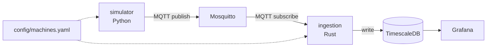

# MQTT Telemetry Lab

Industrial IoT demo project: machine data simulation, MQTT ingestion,
time-series storage, dashboard, anomaly detection.
See `docs/spec.md` and `docs/spec_source.pdf` for full architecture notes.

## Stack
- MQTT broker: Mosquitto (Docker)
- Ingestion: Rust (MQTT subscriber -> DB)
- Time-series DB: TimescaleDB (Postgres + extension)
- Dashboard: Grafana (auto provisioning)

## Structure
```
.
├── simulator/   # multi-machine simulator (Python, MQTT publisher)
├── ingestion/   # ingestion service (Rust, MQTT subscriber -> TimescaleDB)
├── storage/     # TimescaleDB init/schema
├── dashboard/   # Grafana provisioning (datasource + dashboards)
├── config/      # Mosquitto config + machines.yaml (machines/lines/thresholds)
└── docs/        # project spec
```

## Architecture


## Status
All components implemented and working end-to-end: simulator publishes
telemetry for 3 machines across 2 lines, ingestion writes it to TimescaleDB,
Grafana displays it live (per-machine time series, state timeline, current
status table, fault annotations). See checklist in `docs/spec.md`.

## Run
```bash
cp .env.example .env   # then edit .env with your own values
docker compose up -d
```

| Service     | URL / Port              | Notes                                  |
|-------------|--------------------------|-----------------------------------------|
| Grafana     | http://localhost:3000    | Login with `GRAFANA_ADMIN_USER`/`GRAFANA_ADMIN_PASSWORD` from `.env`; dashboard "Factory Overview" |
| TimescaleDB | `localhost:5432`         | Connect with any Postgres client (e.g. DBeaver) using the `POSTGRES_*` values from `.env` |
| Mosquitto   | `localhost:1883`         | MQTT broker, topic `factory/{line}/{machine_id}/telemetry` |

To follow logs for a single service: `docker compose logs -f simulator` (or
`ingestion`, `grafana`, ...).
