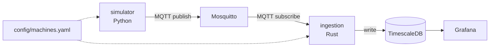

# MQTT Telemetry Lab

Industrial IoT demo project: machine data simulation, MQTT ingestion,
time-series storage, dashboard, anomaly detection.
See `docs/spec.md` and `docs/spec_source.pdf` for full architecture notes.

## Stack
- MQTT broker: Mosquitto (Docker)
- Ingestion: Rust (MQTT subscriber -> DB)
- Time-series DB: TimescaleDB (Postgres + extension)
- Dashboard: Grafana (auto provisioning)

## Structure
```
.
├── simulator/   # multi-machine simulator (Python, MQTT publisher)
├── ingestion/   # ingestion service (Rust, MQTT subscriber -> TimescaleDB)
├── storage/     # TimescaleDB init/schema
├── dashboard/   # Grafana provisioning (datasource + dashboards)
├── config/      # Mosquitto config + machines.yaml (machines/lines/thresholds)
└── docs/        # project spec
```

## Architecture (draft)


## Status
Skeleton only — no component implemented yet. See checklist in `docs/spec.md`.

## Run (WIP)
```bash
cp .env.example .env   # then edit .env with your own values
docker compose up -d
```
