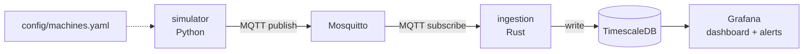

# MQTT Telemetry Lab

[](https://github.com/GiuseppeSaluto/MQTT-Telemetry-Lab/actions/workflows/ci.yml)

Industrial IoT lab: simulated machines publish telemetry over MQTT, a Rust
service ingests it into TimescaleDB, and Grafana shows live trends,
availability / downtime / energy per machine, and statistical anomaly
detection with alerting. Every piece runs as its own Docker service.


## Architecture

```mermaid
flowchart LR
    SIM[simulator\nPython] -->|MQTT publish| MQ[Mosquitto]
    MQ -->|MQTT subscribe| ING[ingestion\nRust]
    ING -->|write| DB[(TimescaleDB)]
    DB --> GRAF[Grafana\ndashboard + alerts]
    CFG[config/machines.yaml] -.-> SIM
```

| Component | What it does |
|---|---|
| `simulator/` | 3 machines on 2 lines, read from `config/machines.yaml`. Each is a running / idle / fault state machine with drifting, noisy readings (temperature, vibration, rpm, power) and occasional fault spikes. |
| `ingestion/` | Subscribes to `factory/+/+/telemetry` and writes to TimescaleDB. A bad message is logged and skipped, never crashes the service; resubscribes after every reconnect; clean shutdown on SIGTERM. |
| `storage/` | Hypertable (1-day chunks, 30-day retention) and two SQL functions: `machine_kpis()` (availability, minutes per state, kWh) and `anomaly_scores()` (rolling z-score). |
| `dashboard/` | Grafana provisioned as code: datasource, "Factory Overview" dashboard, alert rule on detected anomalies. |

## Design choices
- **TimescaleDB**: the data is fixed-schema numeric time series queried by
  time range, so plain SQL with window functions fits, and time partitioning
  skips the chunks outside the range. The anomaly alert query reads only the
  last minutes: 3.6 ms on 30 days of data (3.9M rows), against 61 s for the
  first version, which scored the whole table.
- **Rust for ingestion**: a single small binary with no runtime, the piece
  that would sit on an edge gateway next to the machines. At this data rate
  Python would cope too, and a config-only tool such as Telegraf could replace
  it; the point here is a robust, low-footprint consumer.
- **Anomaly detection independent of the fault label**: the z-score never
  looks at the simulator's `fault` state, it only sees the numbers. Idle
  samples are left out, since a stopped machine is a known operating mode,
  not an anomaly.
- **Availability, not full OEE**: performance and quality need part counts
  (good / rejected), which the simulator doesn't produce.
- **No hardcoded config**: machines, lines and thresholds come from
  `config/machines.yaml`, credentials from `.env`.

## Scope
A lab, not a production deployment: the data is simulated, there is no real
PLC, OPC UA or fieldbus connection, and the broker runs without auth/TLS
(bound to localhost only).

## Run
```bash
cp .env.example .env   # then edit .env with your own values
docker compose up -d
```

| Service     | URL / Port              | Notes                                  |
|-------------|--------------------------|-----------------------------------------|
| Grafana     | http://localhost:3000    | Login with `GRAFANA_ADMIN_USER`/`GRAFANA_ADMIN_PASSWORD` from `.env`; dashboard "Factory Overview" |
| TimescaleDB | `localhost:5432`         | Connect with any Postgres client (e.g. DBeaver) using the `POSTGRES_*` values from `.env` |
| Mosquitto   | `localhost:1883`         | MQTT broker, topic `factory/{line}/{machine_id}/telemetry` |

To follow logs for a single service: `docker compose logs -f simulator` (or
`ingestion`, `grafana`, ...).

## Tests
CI runs clippy and the unit tests for the Rust service, ruff and pytest for
the simulator, and validates the compose file. The SQL functions have
self-checks in `storage/tests/`, run against the database (see
`storage/README.md`).
